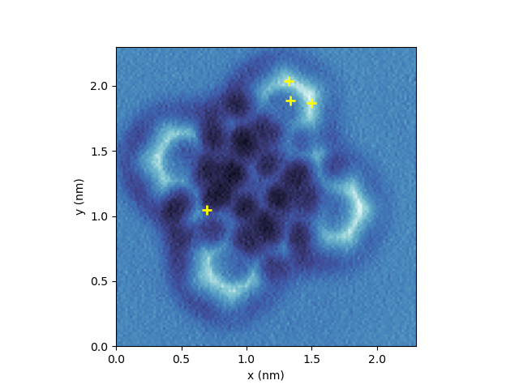
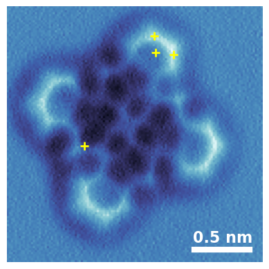

## Accessing SpmImage Tycoon data via Python

This example shows how to access the Tycoon data via Python. We will read the database, pick a specific image and its associated spectra and then plot the image along with the locations of the spectra.

SpmImage Tycoon uses a [HDF5](https://en.wikipedia.org/wiki/Hierarchical_Data_Format)-compatible database, which can be read using the [h5py package](https://www.h5py.org/).

First, we import the necessary packages. The packages can be installed using `pip install <package name>`.

```python
import h5py
import matplotlib.pyplot as plt
import numpy as np
import os
import PIL.Image
```

Now, we define the function to read the database. The function takes the path to the data directory as an argument and returns a list of all the items in the database. Also, later we will need a function that translates the spectrum position from the global scan frame coordinate system into the local image coordinate system. You can just copy and paste the functions into your code.

```python
def get_griditems(path):
    """Get the griditems from a HDF5 file. Returns a list of dictionaries."""

    # allow path to be a directory or a file
    if os.path.isdir(path):
        if "_spmimages_cache" not in path:
            path = os.path.join(path, "_spmimages_cache")
        db_file = os.path.join(path, "db.jld2")
    else:
        db_file = path

    with h5py.File(db_file, "r") as f:
        ref = f["griditems"][()]
        ref_griditems = f[ref][()]

        griditems = []
        ref = ref_griditems[0]
        ref = f[ref][()][1]
        fieldnames = f[ref][()].dtype.names
        for ref in ref_griditems:
            ref = f[ref][()][1]  # values
            griditem = f[ref][()]
            d = {}
            # ignore deleted items
            if griditem["status"] != 0:
                continue

            # cleanup data
            for k in fieldnames:
                v = griditem[k]
                # time field are stored as a np.void object
                while(isinstance(v, np.void) and len(v.dtype) == 1):
                    v = v[0]
                # convert bytes to string
                if isinstance(v, bytes):
                    v = v.decode("utf-8")
                # resolve references              
                elif isinstance(v, h5py.h5r.Reference):
                    v = f[v][()]
                    # nparray of bytes to string (for keyswords etc.)
                    if isinstance(v, np.ndarray) and v.dtype.char == "O":
                        v = v.astype(str)

                d[k] = v

            griditems.append(d)
    return griditems

def global_to_image_coords(x, y, griditem):
    """Convert global coordinates to image coordinates."""

    # first, shift the coordinates so that the center of the image is 0,0
    x -= griditem["center"][0]
    y -= griditem["center"][1]

    # rotate the coordinates
    theta = np.radians(griditem["angle"])
    c, s = np.cos(theta), np.sin(theta)
    R = np.array(((c, -s), (s, c)))
    x, y = np.dot(R, (x, y))

    # now the 0,0 coordinate should be the lower left corner of the image
    x += griditem["scansize"][0] / 2
    y += griditem["scansize"][1] / 2
    
    return x, y
```

Now, we use the function above to load all the items from the database and find the item with the keyword `"Figure1"`. We load its associated image file (with all the edits done in the Tycoon GUI) and plot it.

```python
dir_data = "C:/Users/ChuckNorris/data/awesome_project/"
griditems = get_griditems(dir_data)

# find the image with the keyword "Figure1"
im = next(g for g in griditems if "Figure1" in g["keywords"])

# load the generated image file
fname = os.path.join(dir_data, "_spmimages_cache", im["filename_display"])
img = np.array(PIL.Image.open(fname))
width, height = im["scansize"][0], im["scansize"][1]

# plot the image
fig, ax = plt.subplots()
implot = ax.imshow(img, extent=(0, width, 0, height))
plt.xlabel("x (nm)")
plt.ylabel("y (nm)")
fig
```


Now let's find all the relevant spectra, i.e. the spectra that are in the region of the image and have a star-rating ≥ 3.

```python
# find all the spectra with a star-rating ≥ 3
isspectrum = lambda g: len(g["scansize"]) == 0
spectra = [g for g in griditems if isspectrum(g) and g["rating"] >= 3]

# plot the positions of the spectra that are in the region of the image
for s in spectra:
    x, y = global_to_image_coords(s["center"][0], s["center"][1], im)
    # if the coordinates are outside the image, skip
    if x < 0 or x > width or y < 0 or y > height:
        continue
    ax.plot(x, y, '+', ms=8, mew=2, c='yellow')

fig
```


OK, finally let's add a scale bar instead of the axis labels.

```python
sbar_width = round(width/5, 1)  # the scale bar will be 1/5 of the image width
margin = width / 20
sbar_x_start = width - sbar_width - margin
sbar_x_end = width - margin
ax.plot([sbar_x_start, sbar_x_end], [margin, margin], '-', c='white', lw=6)
ax.text(sbar_x_end + margin / 4, margin * 1.3, f"{sbar_width} nm", color='white',
    va='bottom', ha='right', fontsize=16, fontweight='bold')
ax.axis("off")

fig
```


Now let's save the whole thing as a svg file and submit it to _Science_:

```python
fig.savefig('Figure1.svg', bbox_inches='tight')
```
